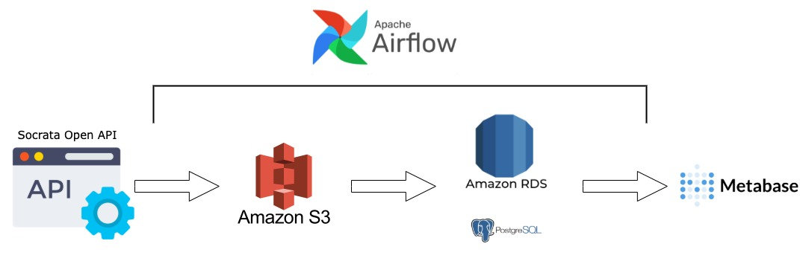

# SF-greenhouse-gas-tracker
Building ELT data pipeline for tracking departmental greenhouse gas emissions of San Francisco. Data is extracted from San Francisco Open Data's 
API, then loaded to data warehouse infrastructure housed in the AWS ecosystem, using Apache Airflow for orchestration. Dashboards for analysing 
greenhouse gas emission is then created using Metabase.

## Architecture

Data is sourced from San Francisco Open Data's API. Airflow orchestrates its movement to an S3 bucket and into a data warehouse hosted in RDS. 
SQL queries are then used to transform the data from its raw form through a staging schema and into production target views. The dashboard is created
using Metabase, an open-source data visualization tool.

## ELT flow
- Data is collected from the Socrata Open Data (SODA) API and moved into an S3 Bucket
- Once the API load to S3 is complete, data is loaded into RDS
- Then data is transformed into staging layer, then mart layer
- ELT job excution is complete once data is moved from staging layer to the mart (i.e., final production tables)

### DAGs
There are 2 DAGs used for this project:
1. `full load`: executed on initial setup 
2. `incremental load`: scheduled to run daily and pull new data from the Socrata Open Data API

### Customer Airflow operators
The DAGs use two customer operators. 
1. `soda_to_s3_operator`: queries the SODA API using SoQL (Socrata Query Language) and loads the results into an S3 bucket, 
also includes optional functions to check source data size and abort ETL if filesize exceeds user-defined limit.
2. `s3_to_postges_operator`: collects data from a file hosted on AWS S3 and loads it into a Postgres table, 
currently only supports JSON and CSV source data types.

## Dashboards

### Resources:

